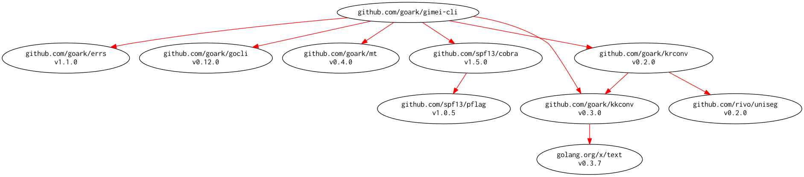

# [gimei-cli] -- 偽名・住所データ生成ツール

[](https://github.com/spiegel-im-spiegel/gimei-cli/actions)
[](https://github.com/spiegel-im-spiegel/gimei-cli/actions)
[](https://raw.githubusercontent.com/spiegel-im-spiegel/gimei-cli/master/LICENSE)
[](https://github.com/spiegel-im-spiegel/gimei-cli/releases/latest)

## ビルド & インストール

```
$ go install github.com/spiegel-im-spiegel/gimei-cli@latest
```

### 実行バイナリ

See [latest release](https://github.com/spiegel-im-spiegel/gimei-cli/releases/latest).

## 簡単な使い方

```
$ gimei-cli -h
偽名・住所データ生成ツール

Usage:
  gimei-cli [flags]
  gimei-cli [command]

Available Commands:
  address     住所名の生成
  cities      市区町村の表示
  completion  generate the autocompletion script for the specified shell
  gimei       偽名の生成
  help        Help about any command
  prefectures 都道府県の表示
  version     バージョン表示

Flags:
      --crypt-rand             crypt/rand 乱数生成器を使う
      --debug                  for debug
  -g, --gender                 「その他」の性別を含める
  -h, --help                   help for gimei-cli
  -j, --json                   JSON形式で表示
  -n, --name string            絞り込み市区町村名（一部でも可）
  -r, --repeat int             試行回数 (default 1)
  -t, --template-path string   テンプレートファイルへのパス
  -u, --unique                 住所名の重複を避ける

Use "gimei-cli [command] --help" for more information about a command.

$ gimei-cli
岡村 智梨 (オカムラ サトリ : 女性) -> 長崎県 北杜市 俵柳 (ナガサキケン ホクトシ タワラヤナギ)

$ gimei-cli --json | jq .
[
  {
    "Gimei": {
      "Gender": 0,
      "FirstName": {
        "Name": "洋輔",
        "Katakana": "ヨウスケ",
        "Hiragana": "ようすけ",
        "Roman": "yousuke"
      },
      "LastName": {
        "Name": "福原",
        "Katakana": "フクハラ",
        "Hiragana": "ふくはら",
        "Roman": "fukuhara"
      }
    },
    "Address": {
      "Prefecture": {
        "Name": "大阪府",
        "Katakana": "オオサカフ",
        "Hiragana": "おおさかふ",
        "Roman": "oosakafu"
      },
      "City": {
        "Name": "安芸郡東洋町",
        "Katakana": "アキグントウヨウチョウ",
        "Hiragana": "あきぐんとうようちょう",
        "Roman": "akiguntouyouchou"
      },
      "Town": {
        "Name": "久々宇",
        "Katakana": "クグウ",
        "Hiragana": "くぐう",
        "Roman": "kuguu"
      }
    }
  }
]
```

テンプレートファイルを指定して任意に整形することも可能。

```
$ cat testdata/template.txt 
| 名前 | 名前カタカナ | 性別 | メールアドレス | 住所 | 住所カタカナ |
| --- | --- | :---: | --- | --- | --- |{{ range . }}
| {{ .Gimei.FullName.Name }} | {{ (.Gimei.FullNameWithSep " ").Katakana }} | {{ .Gimei.Gender }} | {{ .Gimei.Email }} | {{ .Address.FullName.Name }} | {{ (.Address.FullNameWithSep " ").Katakana }} |{{ end }}

$ gimei-cli -r 10 -t testdata/template.txt
| 名前 | 名前カタカナ | 性別 | メールアドレス | 住所 | 住所カタカナ |
| --- | --- | :---: | --- | --- | --- |
| 小谷駿太 | コタニ シュンタ | 男性 | s.kotani@example.com | 青森県駿東郡小山町宍道町白石 | アオモリケン スントウグンオヤマチョウ シンジチョウハクイシ |
| 野口菜瑠 | ノグチ ナル | 女性 | n.noguchi@example.com | 岡山県稲敷郡美浦村覚王寺 | オカヤマケン イナシキグンミホムラ カクオウジ |
| 堀江凌太 | ホリエ リョウタ | 男性 | r.horie@example.com | 静岡県三沢市俵柳 | シズオカケン ミサワシ タワラヤナギ |
| 青柳縁蓮 | アオヤギ エレン | 女性 | e.aoyagi@example.com | 長野県西牟婁郡白浜町西方町金井 | ナガノケン ニシムログンシラハマチョウ ニシカタマチカナイ |
| 藤岡尚登 | フジオカ ナオト | 男性 | n.fujioka@example.com | 滋賀県青森市中畑 | シガケン アオモリシ ナカハタ |
| 小川泰誠 | オガワ タイセイ | 男性 | t.ogawa@example.com | 兵庫県日高郡日高川町酪陽 | ヒョウゴケン ヒダカグンヒダカガワチョウ ラクヨウ |
| 成田文夫 | ナリタ フミオ | 男性 | f.narita@example.com | 沖縄県厚岸郡浜中町新開町 | オキナワケン アッケシグンハマナカチョウ シンカイチョウ |
| 岩瀬恋春 | イワセ コハル | 女性 | k.iwase@example.com | 宮崎県札幌市豊平区上野新 | ミヤザキケン サッポロシトヨヒラク ウワノシン |
| 馬場椎苗 | ババ シイナ | 女性 | s.baba@example.com | 愛知県甘楽郡下仁田町大淀南 | アイチケン カンラグンシモニタマチ オオヨドミナミ |
| 松井善和 | マツイ ヨシカズ | 男性 | y.matsui@example.com | 和歌山県常滑市坪山 | ワカヤマケン トコナメシ ツボヤマ |
```

## Modules Requirement Graph

[](./dependency.png)

[gimei-cli]: https://github.com/spiegel-im-spiegel/gimei-cli "spiegel-im-spiegel/gimei-cli: 偽名・住所データ生成ツール"
